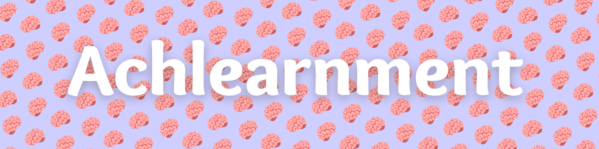
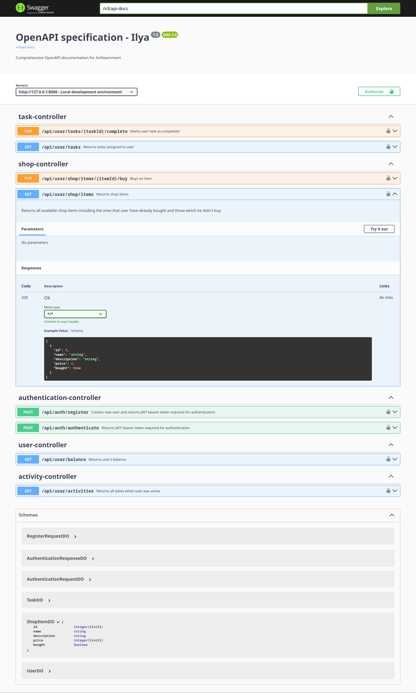
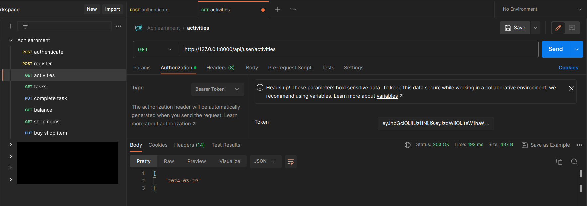
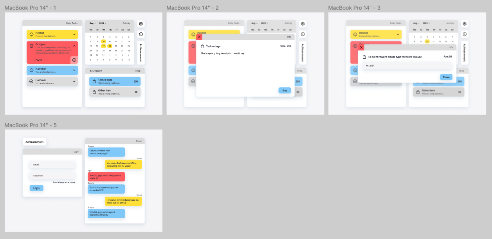
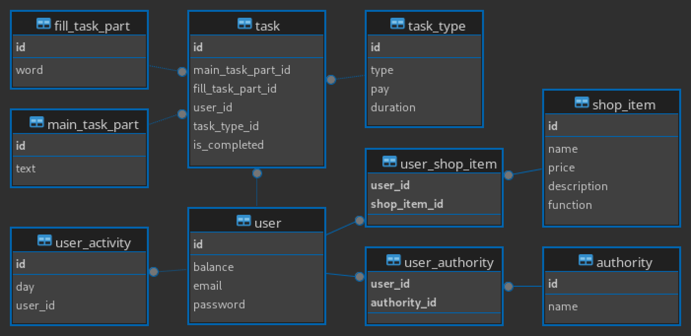
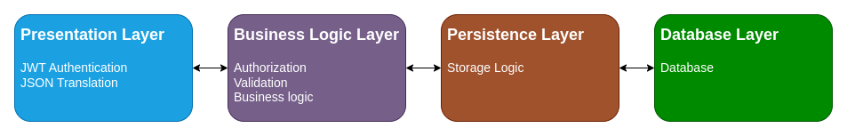

<h1 align="center">
  <br>
  
  <br>
  Achlearnment
</h1>

<h4 align="center">Learn foreign languages the fun way! :uk: :jp: :poland:</h4>

<p align="center">
  <a href="#overview">Overview</a> •
  <a href="#try">Where can I find this application?</a> •
  <a href="#screenshots">Screenshots</a> •
  <a href="#tech-stack">Tech stack</a> •
  <a href="#dev-process">Development process</a> •
  <a href="#app-architecture">Application architecture</a>
</p>

## <a name="tech-stack"></a>:computer: Tech stack

This was built with the help of the following technologies:

| Backend                                                                                                                                                                                                                                                                                                                                                                                                                                                                                                         | Frontend                                                                                                                                                                                                                                                       | CI/CD                                                                                                                          | Additional software                                                                                                                                                                                                                                                                                                                                                                                             |
|-----------------------------------------------------------------------------------------------------------------------------------------------------------------------------------------------------------------------------------------------------------------------------------------------------------------------------------------------------------------------------------------------------------------------------------------------------------------------------------------------------------------|----------------------------------------------------------------------------------------------------------------------------------------------------------------------------------------------------------------------------------------------------------------|--------------------------------------------------------------------------------------------------------------------------------|-----------------------------------------------------------------------------------------------------------------------------------------------------------------------------------------------------------------------------------------------------------------------------------------------------------------------------------------------------------------------------------------------------------------|
| [](https://openjdk.org/)<br/>[](https://spring.io/)<br/>[](https://mariadb.org/)<br/>[](https://swagger.io/) | [](https://react.dev/)<br/>[](https://www.typescriptlang.org/) | [](https://www.docker.com/) | [](https://www.jetbrains.com/idea/)<br/>[](https://dbeaver.io/)<br/>[](https://www.postman.com/)<br/>[](https://www.figma.com/) |

## <a name="overview"></a>:mag_right: Overview

This app is designed to help users learn foreign languages in an engaging and interactive manner. By providing daily tasks
generated randomly, users can continuously improve their language skills while staying motivated by will of wanting to
buy new items in the shop.

Sounds exciting, isn't it :smile:

## <a name="try"></a>:monocle_face: Try it!

Don't worry, I got you covered. You don't have to download anything to start your awesome learning journey with
achlearnment.

Just go to [*website-link-that-is-yet-not-available*](#).

But if you're craving to run your own copy of the application locally you can do so by following these instructions:

> **Note:**
> You need to have [Docker](https://docs.docker.com/engine/install/) installed on your machine.

```bash
# Clone the repository to your local environment
$ git clone https://github.com/iljuhenson/achlearnment-spring-react.git

# Move to the cloned project directory
$ cd achlearnment-spring-react

# Run docker containers with compose
$ docker-compose up
```

## <a name="screenshots"></a>:camera: Screenshots

### :link: Swagger



## <a name="dev-process"></a>:hammer_and_wrench: Development process

### :email: Postman

To conduct manual testing of the backend application Postman was used.



### :art: Figma

To design the app I used figma.



## <a name="app-architecture"></a>:triangular_ruler: Application architecture

### :floppy_disk: Database

This schema fully incapsulates the data representation logic behind achlearnment project:

1. `main_task_part`, `fill_task_part` and `task_type` tables allow to compose a random task which would further be joined and assigned to user inside `task` table.

1. `user_activity` stores dates when user was active. Graphic representation of this table is website's activity calendar. Application's business logic of daily task generation is tied to this table.

1. `shop_item` represents all the available items you can buy in the game. Function is a special column which is tied with application's business logic of attaining perks from bought items. `user` contains balance field which is a part of the shop system too.

1. The rest of `user` fields and `authority` table are used for the authentication logic.

> **Note:**
> All passwords in the database are one end encrypted, no worries :wink:



### :herb: Spring application

To provide maximum extendability and maintainability Achlearnment Spring Application(or Backend) utilizes multilayer architecture.



### :newspaper: React application

This section is under construction :construction:

---

[](https://github.com/iljuhenson) [](https://www.linkedin.com/in/iljuhenson/) [](https://stackoverflow.com/users/20804442/iljuhenson)
